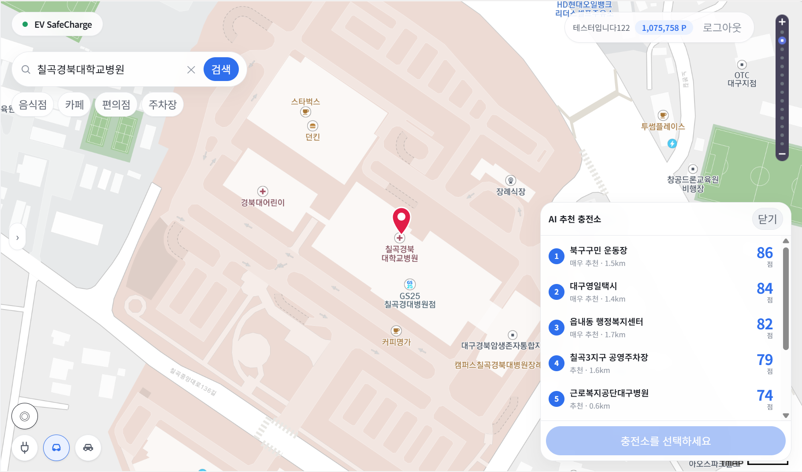
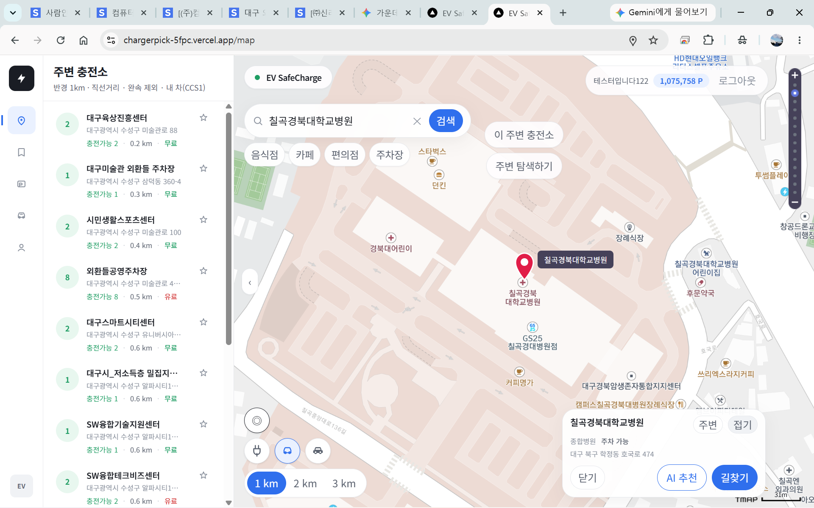
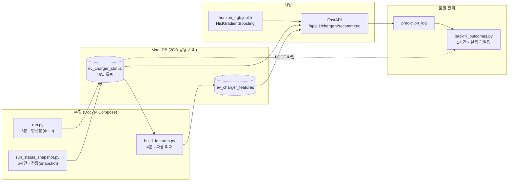

# EV 충전소 도착시점 가용성 예측 API

> 목적지에 **도착했을 때** 그 충전기가 비어 있을 확률을 예측해, 경로상 충전소를 100점으로 랭킹하는 추천 API.
> 대구광역시 충전기 약 25,000대를 5분 주기로 수집해 ETA 5~60분 구간의 가용 확률을 예측한다.



<sub>프론트엔드는 팀원 작업(**EV SafeCharge**). **이 패널의 점수와 라벨은 본 저장소의
`POST /api/v1/chargers/recommend`가 산출한다** — 등급 임계값은
[`scoring.py`](recommend_api/scoring.py)의 `recommendation_label()`.</sub>

**같은 거리인데 점수가 다르고, 다른 거리인데 점수가 같다.**

| 순위 | 충전소 | 거리 | 점수 |
|---|---|---:|---:|
| 1 | 북구구민 운동장 | **1.5km** | **86** |
| 2 | 근로복지공단대구병원 | 0.6km | 84 |
| 3 | 대구영일택시 | 1.4km | 84 |
| 4 | 읍내동 행정복지센터 | 1.7km | 82 |
| 5 | 홈플러스 칠곡점 | **1.5km** | **79** |

두 쌍을 보면 이 시스템이 무엇으로 순위를 정하는지 드러난다.

- **1위와 5위는 거리가 똑같이 1.5km인데 7점 차이가 난다.** 거리로는 설명이 안 된다.
- **2위(0.6km)와 3위(1.4km)는 거리가 2배 넘게 차이나는데 동점 84점이다.**

100점 중 **50점이 "도착 시점에 비어 있을 확률"** 이고 경로 관련 배점은 20점뿐이기 때문이다.
거리는 순위를 흔드는 여러 변수 중 하나일 뿐, 지배 변수가 아니다.

| 화면 | 응답 필드 |
|---|---|
| `86` · `84` · `79` | `recommendation_score` — 가용확률 50 + 경로시간 15 + 충전기수 15 + 속도 10 + 경로거리 5 + 신선도 5 |
| `매우 추천` (≥80) / `추천` (≥65) | `recommendation_label` |
| `1.5km` · `0.6km` | `distance_m` |

그래서 이 프로젝트는 정확도(AUC)만큼 **캘리브레이션(Brier·ECE)** 을 같은 비중으로 본다.
확률이 순위만 정하는 게 아니라 **점수의 절반을 그대로 차지**하기 때문에,
"70%"라고 했으면 실제로 70%여야 한다.

> 실제로 운영에서 **0.45인 확률이 0.86으로 나가고 있었다.** 그걸 찾아 고친 기록이
> [설계 판단 2](#2-점수를-망치던-성분을-찾아-제거한-일)다.

<details>
<summary>같은 화면의 이전 단계 — "지금 상태"와 "도착 시점 예측"의 차이</summary>



왼쪽 목록은 **지금** 비어 있는 대수(`충전가능 2`)다. 공공 API만으로 만들 수 있다.
목적지 카드의 `AI 추천`을 누르면 위 패널로 넘어가고, 거기서는 **도착 시점**을 예측한다.
이 차이가 프로젝트 전체의 출발점이다.

</details>

---

## 담당 범위

4인 팀 프로젝트에서 **데이터·모델·API 부분**을 맡았다. 이 저장소가 그 범위다.

| 영역 | 한 일 |
|---|---|
| 데이터 | 공공 API 수집 ETL, MariaDB 스키마·보존 정책, 파생 피처 빌드 |
| 모델 | 라벨 설계, 피처 선정, 학습 파이프라인, 평가 체계(홀드아웃·워크포워드·캘리브레이션) |
| 서빙 | FastAPI 추천 API, 100점 랭킹 로직, 예측 로그·실측 백필 |
| 운영 | Docker Compose 서비스 구성, Lightsail 배포, DB 튜닝, 배포 드리프트 검출 |

**내가 하지 않은 것**

- **프론트엔드** — 위 데모 화면(EV SafeCharge)은 팀원 작업이다. 나는 그 화면이 쓰는 API를 만들었다.
- **백엔드 앱** — 로그인·즐겨찾기·결제 등 서비스 기능. 이 API를 HTTP로 소비하는 쪽이다.
- **데이터 원천** — 충전기 상태는 한국환경공단 공개 API가 준다. 내가 만든 건 그걸
  시계열로 쌓고 예측 가능한 형태로 바꾸는 부분이다.

경계를 API로 그은 이유는 [설계 판단 4](#4-모델이-아니라-api를-넘긴-이유)에 적었다.
혼자 정한 게 아니라 백엔드와 응답 스키마를 맞춰가며 정리했고,
점수 변경처럼 값의 분포가 바뀌는 배포는 [공지 문서](docs/공지_stat3_점수변경_20260812.md)로 먼저 알렸다.

---

## 왜 이 문제인가

기존 충전소 앱은 **지금 이 순간** 비어 있는지를 보여준다. 그런데 사용자가 실제로 도착하는 건
20분 뒤다. 그 사이 상태가 바뀌면 헛걸음이 된다.

이 프로젝트는 질문을 바꿨다 — "지금 비어 있나?"가 아니라 **"내가 도착할 때 비어 있을까?"**.
그래서 출력은 불리언이 아니라 **확률**이고, 확률을 그대로 점수에 싣기 때문에
정확도(AUC)만이 아니라 **캘리브레이션(Brier·ECE)** 이 같은 비중의 지표가 된다.

---

## 시스템 구성



**핵심 설계 하나**: 수집을 `delta`(5분 변경분)와 `snapshot`(6시간 전량) 두 갈래로 나눴다.
delta만으로는 12일간 한 번도 상태가 안 바뀐 충전기가 관측되지 않는다 — 복원 패널 셀의
**16.2%가 "첫 등장 전"** 이었다. snapshot이 그 앵커 역할을 한다.
자세한 내용은 [설계 판단 3](#3-행이-없다를-모른다로-읽지-않기).

---

## 성능

정본 모델(`horizon_hgb`, HistGradientBoosting, 피처 25개, ETA 5·10·15·20·30·45·60분)의
**워크포워드 8폴드** 결과다. 확장창 · 3일 간격 · 최소 학습 5일 · OOS 2026-07-27~08-18.

| 지표 | 값 |
|---|---|
| ROC-AUC | **0.9735 ± 0.0038** |
| Brier | **0.0412 ± 0.0042** |
| 사용불가 Recall | **0.8677 ± 0.0077** |

ETA가 멀어질수록 어려워지는 구조가 폴드 전반에 일관되게 나타난다.

| ETA | 5분 | 15분 | 30분 | 45분 | 60분 |
|---|---:|---:|---:|---:|---:|
| 사용불가 Recall | 0.9684 | 0.9153 | 0.8383 | 0.7594 | 0.7458 |
| 표준편차 | 0.0058 | 0.0099 | 0.0110 | 0.0089 | 0.0089 |

원자료: [`horizon_hgb_metrics_20260818.json`](data/reports/horizon_hgb_metrics_20260818.json)
· [`walkforward_20260818.json`](data/reports/walkforward_20260818.json)

> **이 표를 읽는 법**: 단일 홀드아웃 창 하나로 모델을 비교하지 않는다.
> 폴드 간 표준편차(AUC 0.0038)보다 작은 차이는 차이로 주장하지 않는 것이 이 프로젝트의 판정 규칙이다.
> 실제로 홀드아웃 두 개를 비교해 "AUC +0.0040 개선"으로 보였던 건이 있었는데,
> 같은 행에 두 모델을 태워보니 **+0.0002**였다. 창의 기저율이 달랐던 것이다(0.7581 vs 0.7736).
> 그 규칙을 만들게 된 계기가 [설계 판단 1](#1-모델을-바꾸지-않기로-한-이유).

---

## 설계 판단

이 저장소의 커밋 31개 중 상당수는 **기능 추가가 아니라 "측정하고 기각한" 기록**이다.
아래 네 건이 이 프로젝트에서 가장 설명하고 싶은 부분이다.

### 1. 모델을 바꾸지 않기로 한 이유

> 이 실험은 서빙 모델(충전기 단위)과 **별개인 충전소 단위 트랙**에서 수행했다.
> 데이터가 1,616,859행 · 충전소 1,590곳으로 통제된 비교가 가능해 알고리즘 선택 실험대로 썼고,
> 여기서 얻은 **판정 규칙**을 서빙 모델 평가에 그대로 적용했다.

모델 15종 + 규칙 기준선 3종을 비교했다. 트리 계열 8개가 PR-AUC(사용불가) 0.70~0.73 안에
전부 뭉쳤고, rolling 9폴드에서 도전자 4개(LGBM·XGB·CatBoost·RF) 전부 **"차이 없음"** 판정이 나왔다.

**폴드 간 표준편차 ±0.025가 모델 간 격차 0.003보다 8배 컸다.** 날짜를 바꾸는 게 모델을
바꾸는 것보다 8배 큰 영향을 준 것이다.

여기서 두 가지가 나왔다.

1. **판정 규칙** — `|Δ평균| < Δ표준편차`면 차이를 주장하지 않는다. 승패 카운트로 고르지 않는다
   (CatBoost는 9폴드 중 7승 2패인데 Δ평균이 −0.0001이었다. 찔끔 이기고 크게 한 번 졌다).
   이 규칙이 이후 모든 승격 판단의 기준이 됐다.
2. **진짜 병목은 피처였다** — 같은 데이터에 시계열 피처 8종을 추가하니 h30 PR-AUC가
   0.4627 → 0.5535 (+20%), 사용불가 recall 0.229 → 0.379 (+65%). 모델 교체로 얻은 0.003의 **30배**다.

부수적으로, `class_weight` 계열은 채택하지 않았다. 사용불가 recall 0.65 → 0.83을 얻는 대신
**ECE가 0.003 → 0.13으로 40배 악화**된다. 확률을 그대로 100점 점수에 싣는 구조라 쓸 수 없었다.
recall이 필요하면 가중치가 아니라 임계값을 내리는 게 맞다.

→ [상세](docs/portfolio/CASE_01_model_bench.md) · 근거 `data/reports/MODEL_BENCH_RESUME.md`

### 2. 점수를 망치던 성분을 찾아 제거한 일

최종 점수는 HGB 확률과 "잔여 충전시간" 성분의 가중 블렌드였고, 잔여시간 비중이 0.75였다.
워크포워드 6폴드로 최적 비중을 스윕한 결과 **18셀 중 17셀에서 최적값이 0**이었다.
블렌드가 있을 때 Brier 악화폭은 ETA10 +9.8% · ETA20 +22.7% · **ETA30 +53.3%**.

배포 직전 운영 실측에서도 HGB가 0.4499로 예측한 충전기가 블렌드 때문에 0.8625로 나가고 있었다.
비중을 0으로 내렸다. **성분 자체는 지우지 않았다** — 백엔드가 이미 응답 필드를 읽고 있어
표시용으로는 계속 내보낸다. 값이 틀린 게 아니라 점수에 실린 비중이 틀렸던 것이다.

→ [상세](docs/portfolio/CASE_02_blend_weight.md) · 근거 `data/reports/세션종료해저드_20260812.md`

### 3. "행이 없다"를 "모른다"로 읽지 않기

수집 API는 **상태가 바뀐 충전기만** 준다. 즉 행이 없다는 건 "관측 실패"가 아니라
"상태가 그대로였다"는 뜻이다. 이벤트 행을 그냥 세서 가용률을 구하면 **71.4%로 부풀려진다**(실제 66% 수준).

LOCF(마지막 상태 유지)로 점유 패널을 복원했고, 복원 정확도를 스냅샷 정답과 대조해
staleness 8시간 이내 **97.7%**, 12~24시간 **73.2%**로 붕괴함을 확인했다.
그래서 라벨 유효 staleness를 480분으로 잘랐다.

→ [상세](docs/portfolio/CASE_03_locf_label.md)

### 4. 모델이 아니라 API를 넘긴 이유

모델 입력 25개 중 절반이 DB 시계열에서 나온다(`avail_ratio_60m`, `changes_30m`,
`time_since_charge_ended` …). 요청 payload만으로는 만들 수 없어 **joblib만 넘기면 백엔드가 쓸 수 없다.**
그렇다고 DB 접속정보와 서빙 코드 일체를 넘기면 재학습마다 백엔드를 같이 배포해야 하고,
피처 스키마가 어긋나면 예외가 아니라 **조용히 틀린 예측**이 나온다.

그래서 경계를 HTTP로 그었다. 스키마 정본은 손으로 쓴 문서가 아니라 서버가 스스로 내는
`GET /openapi.json`이다(수기 문서는 실제로 코드와 어긋나서 폐기했다).

→ [상세](docs/portfolio/CASE_04_api_boundary.md)

### 보너스. 2GB 서버와 12GB 설계행렬

학습 데이터가 base 2,106,246행 → 7개 지평 전개 후 **14,498,475 샘플**로 늘면서
설계행렬이 RAM에 안 들어가게 됐다. memmap 기반 단계 적재 경로를 만들었는데,
디스크를 아끼려고 float32로 저장했더니 오히려 피크 RAM이 **23GB**로 뛰었다.
sklearn 1.9.0의 HGB가 `float64`만 제로카피로 읽고 float32는 적합 시 전량 업캐스트 복사하기 때문이다.
float64로 되돌려 피크를 **11GB**로 낮췄다 — 디스크 6.09GB → 12.18GB를 대가로.

→ [상세](docs/portfolio/CASE_05_staged_training.md)

---

## 조용한 실패를 막는 장치

이 프로젝트에서 가장 위험했던 버그들은 예외를 던지지 않았다. 그래서 검출 장치를 따로 만들었다.

| 장치 | 막는 것 |
|---|---|
| `/health`의 `feature_coverage` | 피처 빌더가 밀리면 INNER JOIN 때문에 **에러 없이 추천 후보만 줄어든다** |
| `/health`의 `code_fingerprint` | 서버-로컬 코드 드리프트. `recommend_api/**/*.py` 내용 해시라 커밋 없이 대조된다 |
| `prediction_log` + `backfill_outcomes` | 예측을 남기고 1시간마다 실측 라벨을 채워 온라인 성능을 사후 검증 |
| 콜레이션 명시 | `utf8mb4_general_ci` / `unicode_ci` 불일치 시 조인이 죽고 **주차 정보만 조용히 사라졌다** |
| `scikit-learn==1.9.0` 정확 고정 | joblib 피클은 학습 환경 버전에 묶여 있어 마이너 차이만으로 조용히 다른 예측이 나온다 |

---

## 기술 스택

| 구분 | 사용 |
|---|---|
| 언어 | Python 3.11 |
| 모델 | scikit-learn 1.9.0 (HistGradientBoosting), numpy memmap 단계 적재 |
| 서빙 | FastAPI, Uvicorn, Pydantic v2 |
| 데이터 | MariaDB, PyMySQL, pandas (`merge_asof` 기반 시계열 조인) |
| 인프라 | Docker Compose (7 서비스), AWS Lightsail |
| 데이터 출처 | 한국환경공단 충전기 API, 기상청 ASOS, 지자체 주차장 API |

---

## 규모

| 항목 | 값 |
|---|---|
| 대상 | 대구광역시 충전기 약 25,000대 |
| 수집 주기 | 변경분 5분 / 전량 스냅샷 6시간 / 파생 피처 4분 |
| 보존 | 상태 이력 45일 롤링 (정책 없이 두면 일 74MB 증가) |
| 현재 적재 | 충전기 3.3GB + 주차장 1.8GB |
| 학습 규모 | base 2,106,246행 → 지평 전개 14,498,475 샘플 |

---

## 실행

```bash
# 추천 API 서버
py -m recommend_api.main          # http://localhost:8000/docs

# 모델 재학습 (저메모리 단계 적재 경로)
py -m recommend_api.train --staged --work-dir /tmp/WORK

# 워크포워드 평가 (memmap 재사용, DB 접속 없음)
py scripts/analysis/walkforward_staged.py --work-dir /tmp/WORK --write-metrics
```

`.env` 설정은 [.env.example](.env.example) 참고.

---

## 한계와 다음 단계

솔직하게 적어둔다.

- **ETA 30분 이상이 병목이다.** 사용불가 Recall이 h5 0.9684에서 h60 0.7458로 떨어진다.
  표준편차가 0.009로 작아 특정 시기 운이 아니라 **전 구간에서 일관된 구조적 한계**다.
- **재학습이 성능을 올리지는 않는다.** 8폴드에서 학습행이 2.46M→13.79M(5.6배)로 늘어도
  AUC 상관은 −0.060이었다. 재학습은 개선이 아니라 **낡음 리셋(유지보수)** 으로 취급한다.
- **온라인 지표를 낼 표본이 없다.** 예측 로그 배선은 정상이고 96.3%가 라벨링되지만,
  17일간 1,717건뿐이라 실사용 트래픽이 아니라 테스트 호출로 보인다.
- **주차장 데이터 결합은 기각했다.** 시간대 평균 제거 후 잔차 상관 −0.073 (R² 0.54%).
  충전 구획이 대개 전용이라 주차장이 만차여도 충전기는 비어 있다. 표시용으로만 살렸다.

---

<sub>이 저장소는 실제 운영 중인 팀 프로젝트에서 비밀정보를 제거해 정리한 스냅샷입니다.
서버 접속정보 · DB 계정 · 외부 API 키는 포함되어 있지 않습니다.</sub>
